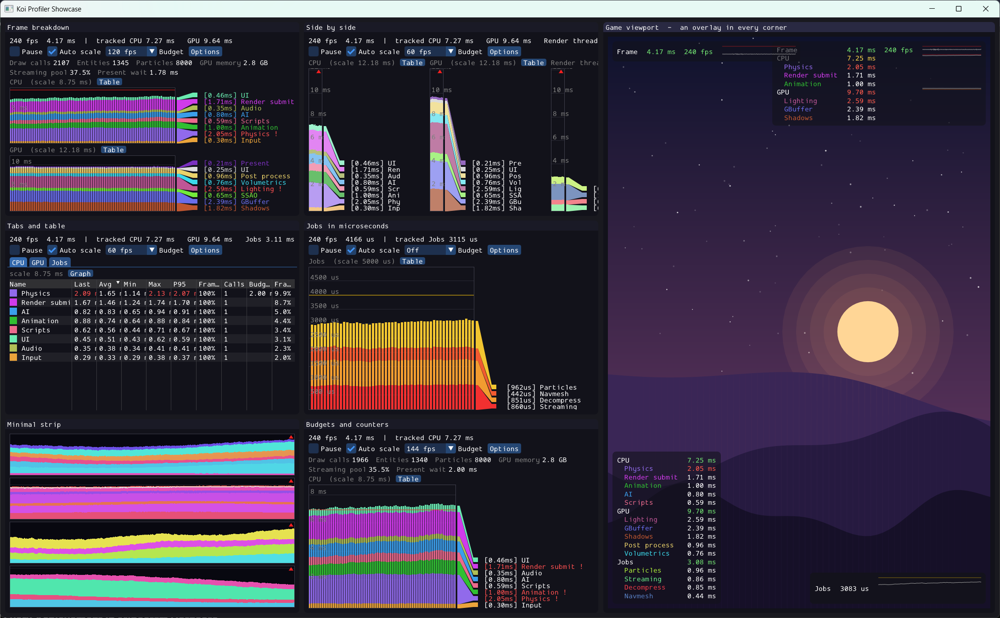
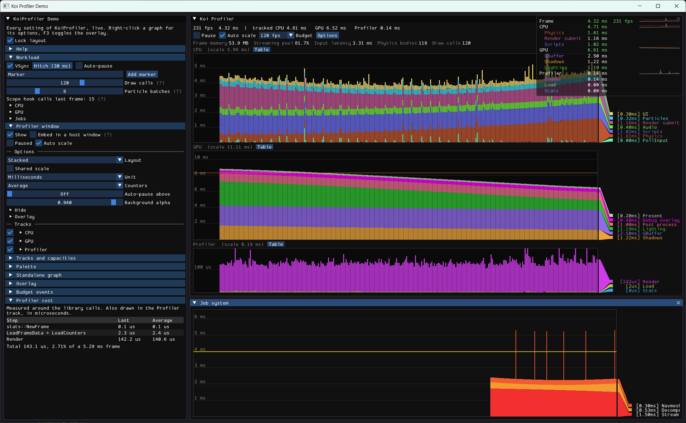

# KoiProfiler

A single-header profiler that draws per-frame timings in [Dear ImGui](https://github.com/ocornut/imgui).

`koi::prof::ProfilerGraph` draws one stacked bar graph with a legend. Use it for CPU or GPU timings, or anything else you time per frame. `koi::prof::ProfilerWindow` is a full window with any number of these graphs (called tracks; CPU and GPU by default), plus counters and controls. On top of that you get per-name budgets, a stats table, frame markers, an in-game overlay, settings saved to `imgui.ini`, and optional scope macros to record CPU timings for you.



Contents
--------
- [Credits](#credits)
- [Changes from the Koi engine version](#changes-from-the-koi-engine-version)
- [What you can do with it](#what-you-can-do-with-it)
- [Requirements and platforms](#requirements-and-platforms)
- [Namespace](#namespace)
- [Usage](#usage)
  - [Saving settings](#saving-settings)
  - [Embedding](#embedding)
  - [Loading tasks](#loading-tasks)
- [Per-name budgets](#per-name-budgets)
  - [Budget callbacks](#budget-callbacks)
- [Overlay](#overlay)
- [Counters](#counters)
- [Memory](#memory)
- [Customizing](#customizing)
- [Compiling features out](#compiling-features-out)
- [Colors](#colors)
- [Frame stats](#frame-stats)
- [Samples](#samples)
  - [Showcase](#showcase)
  - [Demo](#demo)
  - [Building](#building)
- [API reference](#api-reference)
  - [Data](#data)
  - [Enums](#enums)
  - [GraphConfig](#graphconfig)
  - [GraphStyle](#graphstyle)
  - [AutoScaleSettings](#autoscalesettings)
  - [ProfilerGraph](#profilergraph)
  - [TrackConfig and ProfilerTrack](#trackconfig-and-profilertrack)
  - [WindowConfig](#windowconfig)
  - [ProfilerWindow](#profilerwindow)
  - [OverlaySettings](#overlaysettings-no_overlay)
  - [ColorPalette](#colorpalette)
  - [Functions](#functions)
  - [Macros](#macros)
- [License](#license)

Credits
-------
KoiProfiler started as a fork of [LegitProfiler](https://github.com/Raikiri/LegitProfiler) by Alexander Sannikov ([Raikiri](https://github.com/Raikiri)). I forked it for my own private use game engine, Koi, and over time rewrote most of it. The look of the graph comes from the original, and the code is still under the same MIT license. If you like the graph style, the credit for it goes to the original project.

Changes from the Koi engine version
-----------------------------------
This profiler first lived inside the Koi engine, where it relied on engine systems and coupled with engine code. For this repo it was reworked into a standalone library that anyone can use: a single header that needs only ImGui, with settings in place of hard-coded values and optional features you can compile out.

What you can do with it
-----------------------
- Show CPU, GPU or any other per-frame timings as stacked graphs, in one window or as standalone widgets.
- Lay out tracks stacked, side by side or in tabs, with a shared scale if you want to compare them.
- Pause, scrub back through history, click a frame to inspect it, and auto-pause when a frame spikes.
- Hover a frame for a breakdown of its tasks, markers and source locations.
- Load your own task types straight from any container, with a small traits specialization.
- Swap any graph for a sortable table of last, average, min, max and 95th percentile times, and calls per frame.
- See how many times a scope ran in a row, like a function called in a loop.
- Set a frame budget, and a budget per task name (a fixed time, or a share of the frame).
- Get a callback when a frame or a name goes over its budget.
- Mark events like "Level loaded" on the graph.
- Show counters (draw calls, memory, ...) with units like bytes, time and percent, and min, average, max and a small plot on hover.
- Draw a compact overlay in a corner of the screen or of any panel, like Unreal's `stat unit`.
- Restyle everything: colors, sizes, legend, grid, units, palettes and window parts.
- Edit all settings live with ready-made editors, and keep them across runs in `imgui.ini`.
- Time your own code with `KOI_PROFILE`, with names hashed at compile time, and forward those scopes to another profiler like Tracy.
- Control memory with fixed capacities, and compile out any feature you don't need.

Requirements and platforms
--------------------------
- **C++17** or newer. The header stops with an error on older standards.
- **Dear ImGui 1.89.7** or newer, since it uses `SetItemTooltip` and `BeginItemTooltip`. So far only 1.92.9 has been tested. The docking branch works but isn't needed.
- `imgui_internal.h` must be on the include path, for saving settings to `imgui.ini`. Define `KOI_PROFILER_NO_SETTINGS` if you don't want that.
- Nothing else. The header only uses ImGui and the standard library, with no OS or graphics API code, so it should work wherever ImGui does.

What has been tested:

| | |
|---|---|
| Windows x64, MSVC (Visual Studio 2026) | header and both samples build and run |
| Windows x64, Clang 22 | header and both samples compile with `-Wall -Wextra` and no warnings, including with `KOI_PROFILER_MINIMAL` |
| Linux, macOS | not tested yet. `xmake.lua` already links the right OpenGL libraries for them |

You don't need xmake to use the profiler. Copy `KoiProfiler.h` into your project and include it. xmake is only used to build the [samples](#samples), and it downloads ImGui and GLFW for them.

Namespace
---------
Everything is in `koi::prof`, and the frame stats add-on is in `koi::prof::stats`.

KoiProfiler was built for the Koi engine, which keeps its own code in `namespace koi`. The extra `prof` namespace keeps the profiler apart from the rest of the engine. Types like `Counter` or `TimeUnit`, and helpers in `internal`, can't clash with engine code that has the same names. The header can be copied into the engine, or any other project that uses `koi`, as is.

If `koi::prof::` is too long to type, add a short alias, or a using-directive:

```cpp
namespace kp = koi::prof;
kp::ProfilerWindow profiler;

using namespace koi::prof;
ProfilerWindow profiler;

namespace koi = koi::prof;  // This will not work within Koi Engine
```

Macros can't go in a namespace, so they use their own prefixes instead:
- `KOI_PROFILE`, `KOI_PROFILE_DYNAMIC`, `KOI_PROFILE_FUNCTION`, `KOI_PROFILE_COUNT`, `KOI_PROFILE_VALUE` and their hooks are the ones you use in your code.
- `KOI_PROFILER_*` switches features on and off.
- `KOI_PROF_*` (`KOI_PROF_ASSERT`, `KOI_PROF_FUNCTION_NAME`, `KOI_PROF_CONCAT`) are helpers.

Usage
-----
Everything is in the single header `KoiProfiler.h`. The only dependency is ImGui, and you need C++17.

The header uses ImGui's `ImVec2` math operators, so it defines `IMGUI_DEFINE_MATH_OPERATORS` before including `imgui.h`. If your project includes `imgui.h` first, define `IMGUI_DEFINE_MATH_OPERATORS` yourself (in `imconfig.h` or as a compiler define).

```cpp
#include "KoiProfiler.h"

koi::prof::ProfilerWindow profiler;

// Every frame: times in seconds, relative to the start of the frame
koi::prof::ProfilerTask tasks[] = {
	{ 0.0,   0.002, "Physics" },
	{ 0.002, 0.005, "Render", IM_COL32(52, 152, 219, 255) }, // a fixed color instead of one from the palette
};
profiler.LoadFrameData(0, tasks); // track 0 is "CPU". Ignored while paused.
profiler.Render();
```

The top of the window shows the fps and the total tracked time of each track. Below that are the controls:
- **Pause** freezes the graphs. While paused, **Frames back** lets you scrub through the history. The window ignores new `LoadFrameData` and `LoadCounters` calls while paused.
- **Auto scale** fits each graph to the 95th percentile of recent frames, plus 25% headroom, and eases into new values. Rare spikes clip at the top instead of squashing the rest of the graph. Turn it off to set the height yourself with **Scale**.
- **Budget** draws a frame budget line. Pick one from `WindowConfig::BudgetPresets` or type a custom fps. If the budget is above the top of a graph, a small arrow at the top edge points to it.
- **Options** (or right-click a graph) has every setting:
  - for the window: track layout (stacked, side by side or tabs), shared scale, time unit, counter display, auto-pause threshold, background alpha, which parts to hide, and the overlay
  - for each track: visibility, graph or table view, size, frame budget, name budgets, style, auto scale and palette

  `profiler.ShowOptionsEditor()` draws the same options anywhere you like.

Working with a graph:
- Hover a frame to see its tasks, markers and totals in a tooltip. If the hovered task has a source location, that's shown too. Hovering a task or legend entry highlights that name across the whole history.
- Click a frame to pause on it. While paused, scroll over a graph to step through frames.
- The **Table** button next to a track's name swaps the graph for a sortable table. For each name it shows the last, average, min, max and 95th percentile time per frame, how often it shows up, its calls per frame, and its share of the budget. The table updates at most 4 times a second, and only while you can see it.
- Tasks with the same name that come in a row, like a scope inside a loop, are merged into one task, and their calls are counted. The tooltip shows `x12` next to a merged task.
- Set `profiler.AutoPauseMs` (or **Auto-pause above** in the options) to pause when a track loads a frame longer than that. The spike stays on screen for you to look at.
- `profiler.AddMarker("Level loaded", color)` or `graph.AddMarker(...)` puts a line and a flag on the next frame loaded. The name is copied.
- Hover a counter to see its latest value, its min, average and max over the last `StatsInterval`, and a plot of its last `CounterHistoryLength` frames.

### Saving settings

Settings changed in the window's UI are saved to `imgui.ini` and applied the first time the window renders. They're stored under `WindowConfig::SettingsName` (the title by default, or `""` to not save). Tracks are matched by their label. If you change a setting from code and want it saved too, call `profiler.MarkSettingsChanged()`.

This uses ImGui's settings handler API from `imgui_internal.h`. Define `KOI_PROFILER_NO_SETTINGS` to leave it out. If you create a window after the first `ImGui::NewFrame`, call `koi::prof::RegisterSettingsHandler()` right after `ImGui::CreateContext`, so the handler is in place when `imgui.ini` is read.

### Embedding

`profiler.Render()` opens its own window. To put the profiler inside a window or panel of your own, call `profiler.RenderContents()` between your own `Begin` and `End`.

You can also use a `ProfilerGraph` by itself. Load it with `LoadFrameData` and draw it with `Render(size, frameOffset, maxFrameTime)`, or `RenderTable(size)` for the table. As with ImGui widgets, a size of 0 fills the available space. A `maxFrameTime` of 0 uses the graph's auto scale. `Render` returns the frame offset of a clicked frame, or -1.

### Loading tasks

`LoadFrameData` takes a frame in any of these forms, on a `ProfilerWindow` (with the track index first) or a `ProfilerGraph`:

```cpp
profiler.LoadFrameData(0, tasks, count); // a pointer and a count
profiler.LoadFrameData(0, tasks);        // any range: std::vector, std::array, std::span, a C array

// Any range, converted by a function you pass
profiler.LoadFrameData(0, samples, [](const MySample& sample) {
	return koi::prof::ProfilerTask{ sample.Begin, sample.End, sample.Name };
});
```

The elements can be `ProfilerTask`, or your own type. To load your own type without converting it every time, specialize `koi::prof::TaskTraits` for it once:

```cpp
struct GpuTimestamp
{
	const char* Pass;
	double      BeginMs;
	double      EndMs;
};

template <>
struct koi::prof::TaskTraits<GpuTimestamp>
{
	static koi::prof::ProfilerTask ToTask(const GpuTimestamp& t) { return { t.BeginMs / 1000.0, t.EndMs / 1000.0, t.Pass }; }
};

profiler.LoadFrameData(1, gpuTimestamps); // a std::vector<GpuTimestamp>, or any other range of them
```

Each element is converted as it's loaded, so you don't need a staging copy of the frame.

Per-name budgets
----------------
Besides the frame budget line, any task name can have its own budget. It can be a fixed time in any `std::chrono` unit, or a share of the graph's frame budget, which changes with the target fps:

```cpp
using namespace std::chrono_literals;
graph.SetBudget("Physics", 2ms);
graph.SetBudget("Lighting", 2500us);
graph.SetBudgetShare("Scripts", 0.15f); // 15% of graph.BudgetTime
graph.ClearBudget("Physics");
```

When a name goes over its budget, it turns red in the legend with a `!`. The tooltip shows "time / budget", and the table gets a Budget column with the over-budget times in red. Budgets are matched to a name once, when the name is first seen, so they cost nothing per frame. You can edit them under Options > track > Name budgets, and they're saved to `imgui.ini`. A graph holds up to `GraphConfig::MaxBudgets` (16) of them.

### Budget callbacks

To react when something goes over budget, like logging it or sending it to telemetry, set a callback. It's called while a frame loads: once when the frame's tracked time is over `BudgetTime`, and once for every name over its own budget.

```cpp
void OnOverBudget(const koi::prof::BudgetEvent& event, void* userData)
{
	if (event.Name.empty())
	{
		Log("Frame took %.2f ms, budget %.2f ms", event.Time * 1000.0f, event.Budget * 1000.0f);
	}
	else
	{
		Log("%.*s took %.2f ms in %u calls", int(event.Name.size()), event.Name.data(), event.Time * 1000.0f, event.Calls);
	}
}

profiler.SetBudgetCallback(&OnOverBudget, myUserData); // every track. graph.SetBudgetCallback for a single graph
```

- Any object with an `operator()(const koi::prof::BudgetEvent&)` works too: `profiler.SetBudgetCallback(myLogger)`. It's stored by pointer, so it has to outlive the profiler. Nothing is allocated either way.
- `event.Graph` is the graph that loaded the frame, and `profiler.FindTrack(*event.Graph)` gives its track index.
- The callback runs on every frame that's over budget, and not at all while the window is paused. `SetBudgetCallback(nullptr)` turns it off.

Overlay
-------
`profiler.RenderOverlay()` draws a compact summary in a corner of the screen, like Unreal's `stat unit`. It shows the frame time and fps, and for each track its tracked time and its longest names. Each line is green, yellow when close to its budget, or red when over it, and has a small graph of recent frames. The overlay reuses data the window already keeps, so it's cheap. You can draw it with or without the window.

The overlay isn't a window, so it never takes focus or input. By default it's drawn above every window, in a corner of the main viewport, using ImGui's foreground draw list. To put it in a corner of another area, like the scene view of an editor, use `profiler.RenderOverlay(drawList, areaMin, areaMax)`. If you pass that window's draw list, the overlay stays on top of that window but below any window in front of it.

`profiler.Overlay` (an `OverlaySettings`) controls:
- whether it's visible, which corner, and the margin
- background alpha
- which lines and small graphs are shown
- how many names to list per track
- how many frames the times are averaged over
- the size of the small graphs
- the warning threshold

Edit it with `koi::prof::ShowOverlayEditor`, or under Options > Overlay.

Counters
--------
A counter is a named number for each frame, like draw calls or memory in use, shown in a row above the graphs. Load them with `profiler.LoadCounters(counters, count)`, or record them with the [frame stats](#frame-stats) macros.

A `Counter` has a `Name`, a `Value` (a `double`) and a `Unit`, which decides how it's shown:

| `CounterUnit` | Shown as |
|---|---|
| `None` | a plain number, with fewer decimals as it grows |
| `Bytes` | B, KB, MB, GB or TB (1024 based) |
| `Time` | seconds, shown in the window's time unit |
| `Percent` | 0 to 100, with a `%` |

You don't usually set the unit yourself. It comes from the type of the value:

```cpp
using namespace std::chrono_literals;
koi::prof::MakeCounter("Draw calls", drawCalls);                        // None
koi::prof::MakeCounter("Texture memory", koi::prof::Bytes(textureBytes)); // Bytes
koi::prof::MakeCounter("Streaming pool", koi::prof::Percent(poolUsed));   // Percent
koi::prof::MakeCounter("Present wait", 1500us);                           // Time, from any std::chrono duration
```

`KOI_PROFILE_COUNT` and `KOI_PROFILE_VALUE` take the same values. For a type of your own, specialize `koi::prof::CounterTraits` with its unit and how to turn it into a number:

```cpp
template <>
struct koi::prof::CounterTraits<MemorySize>
{
	static constexpr koi::prof::CounterUnit Unit = koi::prof::CounterUnit::Bytes;
	static constexpr double ToValue(MemorySize size) { return double(size.Bytes); }
};
```

Hover a counter to see its latest value, its min, average and max over the last `StatsInterval`, and a plot of its recent history. The window keeps every counter it has seen, and shows 0 in frames that don't report it.

Memory
------
Graphs and windows allocate everything once, in their constructor. The sizes come from a `koi::prof::GraphConfig` or `koi::prof::WindowConfig` (each of the window's `Tracks` has its own `GraphConfig`):

| Setting | Default | |
|---|---|---|
| `GraphConfig::FramesCount` | 300 | frames of history |
| `GraphConfig::MaxTasksPerFrame` | 64 | tasks in one frame, after merging back-to-back tasks with the same name |
| `GraphConfig::MaxUniqueNames` | 128 | different names in the history; names that scroll out are recycled |
| `GraphConfig::MaxNameLength` | 48 | longer names are cut off |
| `GraphConfig::MaxMarkers` | 16 | markers kept; the oldest is replaced |
| `GraphConfig::MaxMarkerLength` | 32 | longer marker names are cut off |
| `GraphConfig::MaxBudgets` | 16 | names with their own budget |
| `WindowConfig::MaxCounters` | 32 | different counters |
| `WindowConfig::MaxCounterNameLength` | 32 | longer names are cut off |
| `WindowConfig::CounterHistoryLength` | 120 | frames of each counter kept for its hover plot, 0 turns it off |
| `WindowConfig::FrameHistoryLength` | 240 | frame times kept for the overlay's frame graph, 0 turns it off |
| `ColorPalette(capacity)` | 256 | different names a palette remembers |

Each stored task takes 20 bytes, so the history takes `FramesCount × MaxTasksPerFrame × 20` bytes per graph (375 KB with the defaults). That's most of the memory. The table, tooltip and markers add about 8 KB per graph. The counter history adds `MaxCounters × CounterHistoryLength × 4` bytes per window (15 KB with the defaults).

Names are copied into the graph, so a task's name only has to stay alive until `LoadFrameData` returns. When a capacity runs out, `KOI_PROF_ASSERT` fires. By default that's `IM_ASSERT`, and you can define your own before including the header. In release builds, whatever didn't fit is dropped.

Customizing
-----------
- `WindowConfig`:
  - title, ImGui window flags, and `ProfilerFlags` to hide parts of the window (`ProfilerWindowFlags_NoHeader`, `NoControls`, `NoOptions`, `NoCounters`, `NoTrackLabels`)
  - the tracks, each with a label, graph capacities, visibility, size and graph or table view
  - layout, shared scale and auto-pause threshold
  - time unit (milliseconds or microseconds)
  - counter display: the latest value, or the average over `StatsInterval` with min, average and max on hover
  - minimum graph height, budget presets and the scale slider's range
  - the starting budget, scale and auto scale
- Tracks: `profiler.GetTrack(index)` returns a `ProfilerTrack`. Its `Graph` has its own style, auto scale settings, palette and budget. `profiler.SetBudgetFps` sets the budget of every track at once.
- `GraphStyle` (`graph.Style`):
  - frame width and spacing, minimum task height
  - legend width and colored legend text
  - time unit
  - background, border, text and budget line colors, and budget line thickness. Colors left at 0 follow the ImGui style. The budget line is red by default.
  - grid lines: on or off, labels, step (or an automatic round step) and color
  - tooltip, how much other names dim while one is highlighted, and marker color
  - the sizes and margins of the legend's markers
- `AutoScaleSettings` (`graph.AutoScale`): percentile, headroom, smoothing time, minimum, and `IncludeBudget` to always keep the budget line in view.
- `graph.BudgetTime` sets the budget line of a single graph.
- `profiler.Render(open, extraFlags)` adds ImGui window flags, for example `ImGuiWindowFlags_NoMove` to keep the window in place.
- `graph.GetUsedNameCount()`, `GetMaxTaskCount()` and `GetLastVertexCount()` tell you how much of each capacity is in use, and how much the graph costs to draw.
- Editors, like `ImGui::ShowStyleEditor`: `koi::prof::ShowStyleEditor(style)`, `ShowAutoScaleEditor(settings)`, `ShowPaletteEditor(palette)`, `ShowNameBudgetEditor(graph)` and `ShowGraphEditor(graph)` (budget, style, auto scale and palette together). Each one returns true when something changed.

Compiling features out
----------------------
Every feature beyond the graphs can be compiled out, along with its types, members and memory. Define any of these before including the header:

| Macro | Removes |
|---|---|
| `KOI_PROFILER_NO_SOURCE_LOCATION` | `SourceLocation`, `ProfilerTask::Location` and the location recorded by scopes. `ProfilerTask` shrinks from 48 to 40 bytes and `stats::Scope` from 40 to 32 |
| `KOI_PROFILER_NO_TABLE` | `TrackView`, `RenderTable` and the per-name stats behind it |
| `KOI_PROFILER_NO_MARKERS` | `AddMarker` and the marker buffers |
| `KOI_PROFILER_NO_INTERACTION` | the tooltip, highlighting, click-to-select and scrolling through frames |
| `KOI_PROFILER_NO_GRID` | grid lines and their style fields |
| `KOI_PROFILER_NO_COUNTER_HISTORY` | the counter plot and the work to fill it each frame |
| `KOI_PROFILER_NO_BUDGETS` | per-name budgets (the frame budget line stays) |
| `KOI_PROFILER_NO_OVERLAY` | `OverlaySettings`, `RenderOverlay` and the frame time history |
| `KOI_PROFILER_NO_EDITORS` | every `Show*Editor` function and the options popup |
| `KOI_PROFILER_NO_SETTINGS` | `imgui.ini` support, and the `imgui_internal.h` include |
| `KOI_PROFILER_MINIMAL` | all of the above |

Colors
------
A task with `Color == 0` gets its color from its graph's `koi::prof::ColorPalette`, based on its name. The first time the palette sees a name, it asks its `Generator` for a color and remembers it by the name's hash. All graphs share `koi::prof::DefaultPalette()` by default, so a name has the same color on the CPU and GPU graphs.

- The default generator, `koi::prof::GoldenRatioColor`, steps the hue by the golden ratio, which keeps colors far apart. To change its hue, saturation, value or alpha, point the palette's `GeneratorUserData` at a `koi::prof::GoldenRatioParams`.
- For a different color scheme, set `palette.Generator` to your own `uint32_t (*)(size_t index, std::string_view name, void* userData)`.
- Pin a name to a color with `palette.SetColor("Render", color)`. `Regenerate()` forgets generated colors but keeps pinned ones, which is useful after changing the generator. `Clear()` forgets every color.
- Give a graph its own palette with `graph.Palette = &myPalette`. Palettes have a fixed capacity too (256 names by default).

Frame stats
-----------
The original LegitProfiler only drew the graphs. You measured the timings yourself and passed them in. KoiProfiler still works that way, and anything you can time can be loaded with `LoadFrameData`. It also comes with an optional add-on that does the measuring for you.

`koi::prof::stats` is that add-on, taken from the Koi engine. You can time CPU work with scopes and count anything per frame, and the results are ready to load into a window. Define `KOI_PROFILER_ENABLE_STATS` before including the header to use them. Without it, the `KOI_PROFILE` macros only run their hooks (which do nothing by default), so you can leave them in your code.

```cpp
#define KOI_PROFILER_ENABLE_STATS
#include "KoiProfiler.h"

koi::prof::stats::Reserve(128, 64); // optional: max scopes and counters per frame

// At the start of every frame
koi::prof::stats::NewFrame();
const auto& counters = koi::prof::stats::GetLastCounters();
profiler.LoadFrameData(0, koi::prof::stats::GetLastFrame());
profiler.LoadCounters(counters.data(), counters.size());

// Anywhere during the frame
{
	KOI_PROFILE("Physics");                                              // the name is hashed at compile time
	KOI_PROFILE_COUNT("Physics bodies", bodies.size());                  // adds up over the frame
	KOI_PROFILE_VALUE("Physics memory", koi::prof::Bytes(physicsBytes)); // replaces, for levels like memory
	...
}

for (const Script& script : scripts)
{
	KOI_PROFILE_DYNAMIC(script.Name); // a name only known at runtime
	script.Run();
}

void UpdateAudio()
{
	KOI_PROFILE_FUNCTION(); // named after the function
	...
}
```

- The scope macros also record their file, line and function in a static constant, so each scope only carries a pointer to it. The graph's tooltip and table then show where a task comes from. You can point `ProfilerTask::Location` at your own `koi::prof::SourceLocation` too.
- `KOI_PROFILE` hashes its name while compiling, so the graph doesn't have to hash it when looking the name up. That means the name has to be a string literal or another constant, and a runtime name is a compile error. Use `KOI_PROFILE_DYNAMIC` for names only known at runtime; those are hashed when loaded instead.
- `KOI_PROFILE_COUNT` adds to a counter over the frame, and `KOI_PROFILE_VALUE` replaces it, for levels like memory in use. Both take any [counter value](#counters), and template types with commas, like `std::chrono::duration<double, std::milli>(x)`, work as they are.
- To also send scopes and counters to another profiler, define any of `KOI_PROFILE_HOOK(name)`, `KOI_PROFILE_DYNAMIC_HOOK(name)`, `KOI_PROFILE_FUNCTION_HOOK()`, `KOI_PROFILE_COUNT_HOOK(name, value)` and `KOI_PROFILE_VALUE_HOOK(name, value)` before including the header. For Tracy, that would be `#define KOI_PROFILE_HOOK(name) ZoneScopedN(name)` and `#define KOI_PROFILE_COUNT_HOOK(name, value) TracyPlot(name, koi::prof::CounterValue(value))`. Hooks run whether the stats are enabled or not.

A few rules:
- Record from one thread only, the one that calls `NewFrame`.
- Only the outermost scope is recorded. Nested scopes are folded into it.
- The same scope recorded several times in a row, like one inside a loop, becomes one task with its calls counted.
- Scope and counter names are not copied, so they must stay alive until the frame has been loaded. String literals are ideal.

Samples
-------
There are two samples, the Showcase and the Demo. Both use `Sample/Common.h`, which opens a window that covers most of the screen and scales ImGui to your monitor's DPI.

### Showcase

`Sample/Showcase.cpp` needs no input. Run it and watch. It shows a gallery of profiler windows, each set up differently:
- **Frame breakdown**: stacked CPU and GPU tracks, with budgets and counters
- **Side by side**: three tracks next to each other on a shared scale
- **Tabs and table**: tracks in tabs, with a stats table
- **Jobs in microseconds**: microsecond units with a fixed grid
- **Minimal strip**: a thin strip with no labels or legend
- **Budgets and counters**: per-name budget shares, and counters with history

Next to them is a made-up game viewport with an overlay in every corner, each one set up differently. All timings are generated. Every few seconds a hitch, shader compile, level load or garbage collection hits a few frames, and gets marked in every graph. Some tasks run as several calls in a row ("Command lists", "Decompress"), and the counters use units: bytes, percent and time.

### Demo

`Sample/Demo.cpp` works like ImGui's demo window: you can change every setting live.



- **Workload**: shape the simulated work. CPU scopes do real work timed with `KOI_PROFILE_DYNAMIC`, since their names can be edited (including nested scopes). A "Particles" scope runs several times in a row to show call counts. The GPU timings are made-up timer query results in a `GpuTimestamp` type, loaded through `TaskTraits`. Counters include memory, a pool's usage and a latency, each with its unit. Add a 30 ms hitch, which gets marked in every graph and can trigger auto-pause. Add your own markers, and turn vsync on or off. The demo defines the scope hooks to count scopes, and times its input handling with `KOI_PROFILE_FUNCTION`.
- **Profiler window**: show the window or embed it in another one, pause and auto scale from code, and everything in Options.
- **Tracks and capacities**: pick the tracks and `GraphConfig` capacities and rebuild the window. A table shows how much of each capacity is in use. The demo replaces `KOI_PROF_ASSERT` to list overflows instead of stopping, so you can shrink the capacities and see what happens.
- **Palette**: switch between the built-in and custom color generators, tweak the golden ratio settings and pin colors.
- **Standalone graph**: a `ProfilerGraph` on its own, with its own palette and settings.
- **Overlay**: every overlay setting. F3 shows or hides it.
- **Budget events**: the latest names (and optionally frames) over budget, as reported by `SetBudgetCallback`.
- **Profiler cost**: the time spent in `stats::NewFrame`, loading and rendering, also drawn in a Profiler track in microseconds, and each graph's vertex count.

With **Lock layout** on, the demo's windows stay sized to the app window. Turn it off to move them around. The demo uses every feature, so it won't build with `KOI_PROFILER_MINIMAL` or any of the `KOI_PROFILER_NO_*` macros.

### Building

The samples use GLFW and OpenGL 3, and build with [xmake](https://xmake.io), which downloads ImGui and GLFW for you:

```
xmake
xmake run Showcase
xmake run Demo
```

API reference
-------------
Everything is in `namespace koi::prof`, and the frame stats are in `koi::prof::stats`. Times are in seconds unless the name says otherwise, and colors are `IM_COL32` values. If an item can be compiled out, the macro that removes it is listed next to it.

### Data

| Type | Members |
|---|---|
| `ProfilerTask` | `StartTime`, `EndTime` (seconds since the frame began), `Name` (copied by the graph), `Color` (0 uses the palette), `NameHash` (`HashName(Name)`, set by `KOI_PROFILE`; 0 hashes on load), `Location` (`const SourceLocation*`, optional; `NO_SOURCE_LOCATION`), `GetLength()` |
| `Counter` | `Name` (not copied, must stay alive until loaded), `Value` (`double`), `Unit` (`CounterUnit`) |
| `Bytes`, `Percent` | counter values with a unit, made from any number: `Bytes(size)`, `Percent(0 to 100)` |
| `BudgetEvent` | `Graph`, `Name` (empty for the frame budget), `Time` and `Budget` (seconds), `Calls` (0 for the frame budget); passed to budget callbacks |
| `SourceLocation` | `File`, `Function`, `Line`; static storage, filled in by `KOI_PROFILE` (`NO_SOURCE_LOCATION`) |
| `NameBudget` | `Name`, `Time` (seconds, 0 for a share), `Share` (of `BudgetTime`, 0 for a time); returned by `GetNameBudget` (`NO_BUDGETS`) |
| `TopTask` | `Name`, `Time` (tasks with the same name added together), `Color`, `Budget` (0 without one); filled in by `GetTopTasks` (`NO_OVERLAY`) |

### Enums

| Enum | Values |
|---|---|
| `TimeUnit` | `Milliseconds`, `Microseconds` |
| `TrackLayout` | `Stacked`, `SideBySide`, `Tabs` |
| `TrackView` | `Graph`, `Table` (`NO_TABLE`) |
| `CounterDisplay` | `Latest`, `Average` (over `StatsInterval`) |
| `CounterUnit` | `None`, `Bytes`, `Time` (seconds), `Percent` (0 to 100) |
| `OverlayCorner` | `TopLeft`, `TopRight`, `BottomLeft`, `BottomRight` (`NO_OVERLAY`) |
| `ProfilerWindowFlags_` | `None`, `NoHeader`, `NoControls`, `NoOptions`, `NoCounters`, `NoTrackLabels` (combined into a `ProfilerWindowFlags` int) |

### `GraphConfig`

| Field | Default | |
|---|---|---|
| `FramesCount` | 300 | frames of history |
| `MaxTasksPerFrame` | 64 | tasks in one frame, after merging back-to-back tasks with the same name |
| `MaxUniqueNames` | 128 | different names in the history |
| `MaxNameLength` | 48 | longer names are cut off |
| `MaxMarkers`, `MaxMarkerLength` | 16, 32 | how many markers are kept, and their name length (`NO_MARKERS`) |
| `MaxBudgets` | 16 | names with their own budget (`NO_BUDGETS`) |

### `GraphStyle`

| Field | Default | |
|---|---|---|
| `FrameWidth`, `FrameSpacing` | 3, 1 | pixels per frame column, and between columns |
| `MinTaskHeight` | 1 | pixels; shorter tasks aren't drawn |
| `LegendWidth` | 260 | pixels; 0 hides the legend |
| `UseColoredLegendText` | false | legend text in each task's color |
| `Unit` | `Milliseconds` | used by the legend, grid, tooltip and table |
| `BackgroundColor`, `BorderColor`, `TextColor` | 0 | 0 draws no background, or follows the ImGui style |
| `BudgetColor`, `BudgetThickness` | red, 1 | the frame budget line |
| `ShowGrid`, `ShowGridLabels` | true, true | grid lines and their labels (`NO_GRID`) |
| `GridStep` | 0 | seconds between grid lines; 0 picks a round step (`NO_GRID`) |
| `GridColor` | 0 | 0 uses the border color at half alpha (`NO_GRID`) |
| `ShowTooltip` | true | hovering a frame lists its tasks (`NO_INTERACTION`) |
| `HighlightDimAlpha` | 0.3 | alpha of the other names while one is hovered; 1 turns highlighting off (`NO_INTERACTION`) |
| `MarkerColor` | white, 160 alpha | for markers added without a color (`NO_MARKERS`) |
| `LegendLeftMarkerMargin`, `LegendLeftMarkerWidth`, `LegendMarkerLinkWidth` | 3, 5, 30 | the legend's left marker and the link to its row |
| `LegendRightMarkerWidth`, `LegendRightMarkerHeight`, `LegendRightMarkerMargin`, `LegendRightMarkerSpacing` | 10, 10, 3, 4 | the color squares in the legend rows |
| `LegendTextMargin` | (5, -3) | offset of the legend text |

### `AutoScaleSettings`

| Field | Default | |
|---|---|---|
| `Percentile` | 0.95 | frames above it clip instead of squashing the graph |
| `Headroom` | 1.25 | multiplier on top of the percentile |
| `SmoothTime` | 0.25 | seconds to settle on a new scale; 0 snaps |
| `MinTime` | 0.00005 | smallest scale |
| `IncludeBudget` | false | always keep the budget line in view |

### `ProfilerGraph`

| Member | |
|---|---|
| `ProfilerGraph(GraphConfig)` | allocates everything up front |
| `Style`, `AutoScale`, `Palette`, `BudgetTime` | public settings. `Palette` defaults to `&DefaultPalette()` and must not be null. A `BudgetTime` of 0 hides the budget line |
| `LoadFrameData(tasks, count)`, `LoadFrameData(range)`, `LoadFrameData(range, toTask)` | adds a frame, merging back-to-back tasks with the same name and color and counting their calls. Elements are `ProfilerTask`, a type with `TaskTraits`, or anything `toTask` turns into a `ProfilerTask` |
| `SetBudgetCallback(callback, userData)`, `SetBudgetCallback(callable)` | called while a frame loads, for the frame and for every name over budget; `nullptr` turns it off |
| `Render(size, frameOffset, maxFrameTime)` | draws the graph and legend. A size of 0 fills the space, and a `maxFrameTime` of 0 auto scales. Returns the offset of a clicked frame, or -1 |
| `RenderTable(size)` | sortable per-name stats table (`NO_TABLE`) |
| `AddMarker(name, color)` | marks the next frame loaded (`NO_MARKERS`) |
| `SetBudget(name, duration)`, `SetBudgetShare(name, share)`, `ClearBudget(name)` | per-name budgets (`NO_BUDGETS`) |
| `GetBudget(name)` | a name's budget in seconds, with shares worked out; 0 if it has none (`NO_BUDGETS`) |
| `GetNameBudgetCount()`, `GetNameBudget(index)` | lists budget slots as `NameBudget`; cleared slots have neither a time nor a share (`NO_BUDGETS`) |
| `GetTopTasks(frameOffset, out, maxCount)` | a frame's longest names, longest first; returns how many (`NO_OVERLAY`) |
| `GetAverageTotalTime(frameCount)` | tracked time, averaged over recent frames (`NO_OVERLAY`) |
| `RenderSparkline(drawList, pos, size, frameCount, color, maxTime)` | recent tracked times as a line, with the budget; a `maxTime` of 0 fits it (`NO_OVERLAY`) |
| `GetTotalTaskTime(frameOffset)`, `GetFrameSpan(frameOffset)` | a frame's tracked time, and the end of its last task |
| `GetAutoScaleTime()` | the auto scale, to pass as `Render`'s `maxFrameTime` |
| `GetConfig()`, `GetUsedNameCount()`, `GetMaxTaskCount()`, `GetLastVertexCount()` | the capacities, how much of them is used, and the vertex count of the last draw |

### `TrackConfig` and `ProfilerTrack`

`TrackConfig` describes one track of a window:
- `Label` (`"Track"`)
- `Graph`, a `GraphConfig`
- `Visible` (true)
- `HeightWeight` (1): its share of the space, as height when stacked or width when side by side
- `View` (`Graph`; `NO_TABLE`)

`profiler.GetTrack(index)` returns the `ProfilerTrack` built from it. It has the same `Label`, `Visible`, `HeightWeight` and `View`, plus its `Graph`.

### `WindowConfig`

| Field | Default | |
|---|---|---|
| `Title` | `"Koi Profiler###KoiProfiler"` | ImGui window title |
| `SettingsName` | null | name in `imgui.ini`; null uses `Title`, `""` doesn't save (`NO_SETTINGS`) |
| `Flags` | `ImGuiWindowFlags_NoScrollbar` | ImGui window flags |
| `ProfilerFlags` | `None` | parts of the window to hide |
| `Tracks` | CPU, GPU | one `TrackConfig` each |
| `Layout` | `Stacked` | how tracks share the window |
| `SharedScale` | false | every track uses the largest auto scale |
| `Unit` | `Milliseconds` | used by the header, labels, scale slider and overlay, and passed to every track |
| `Counters` | `Latest` | how counters are shown |
| `MaxCounters`, `MaxCounterNameLength` | 32, 32 | how many counters, and their name length |
| `CounterHistoryLength` | 120 | frames kept per counter for its hover plot; 0 turns it off (`NO_COUNTER_HISTORY`) |
| `FrameHistoryLength` | 240 | frame times kept for the overlay's frame graph; 0 turns it off (`NO_OVERLAY`) |
| `Overlay` | defaults | starting `OverlaySettings` (`NO_OVERLAY`) |
| `StatsInterval` | 0.5 | seconds between updates of the fps and averaged counters |
| `MinGraphHeight` | 40 | pixels |
| `BudgetFps` | 60 | starting frame budget; 0 hides the line |
| `BudgetPresets` | 0, 30, 60, 120, 144, 240 | choices in the Budget combo |
| `ScaleMs`, `ScaleMinMs`, `ScaleMaxMs` | 16.67, 0.1, 50 | the manual scale, and its slider range |
| `AutoPauseMs` | 0 | pause when a track loads a longer frame; 0 turns it off |
| `AutoScale` | true | whether auto scale starts on |

### `ProfilerWindow`

| Member | |
|---|---|
| `ProfilerWindow(WindowConfig)` | allocates everything up front |
| `ProfilerFlags`, `Layout`, `SharedScale`, `Unit`, `Counters`, `AutoPauseMs`, `Overlay`, `BackgroundAlpha` | public settings, starting from the config. Change `Unit` with `SetUnit`. A negative `BackgroundAlpha` keeps the style's |
| `LoadFrameData(track, ...)`, `LoadCounters(counters, count)` | load a frame, in any form `ProfilerGraph::LoadFrameData` takes; ignored while paused |
| `SetBudgetCallback(callback, userData)`, `SetBudgetCallback(callable)` | the budget callback of every track |
| `FindTrack(graph)` | index of the track that owns a graph, like `*event.Graph`, or -1 |
| `AddMarker(name, color)`, `AddMarker(track, name, color)` | mark the next frame of every track, or of one track (`NO_MARKERS`) |
| `Render(open, extraFlags)` | opens its own window |
| `RenderContents()` | draws into the current window |
| `RenderOverlay(drawList, areaMin, areaMax)` | the overlay; with no arguments it goes above everything in the main viewport (`NO_OVERLAY`) |
| `ShowOptionsEditor()` | the contents of the Options popup, anywhere (`NO_EDITORS`) |
| `IsPaused()`, `SetPaused(paused)`, `IsAutoScale()`, `SetAutoScale(on)` | the controls, from code |
| `GetBudgetFps()`, `SetBudgetFps(fps)` | the frame budget of every track |
| `SetUnit(unit)` | the unit of the window and every track |
| `GetTrackCount()`, `GetTrack(index)`, `GetConfig()` | the tracks and the config |
| `MarkSettingsChanged()` | save settings changed from code to `imgui.ini` (`NO_SETTINGS`) |

### `OverlaySettings` (`NO_OVERLAY`)

| Field | Default | |
|---|---|---|
| `Visible` | true | |
| `Corner`, `Margin` | `TopRight`, (10, 10) | where in the area it goes |
| `BackgroundAlpha` | 0.6 | |
| `ShowFrame`, `ShowTracks`, `ShowGraphs` | true | the frame line, a line per visible track, and a small graph on each |
| `TopNames` | 3 | longest names listed under each track, up to `OverlaySettings::kMaxTopNames` (5) |
| `AverageFrames` | 30 | frames the times are averaged over |
| `GraphFrames` | 120 | frames each small graph covers |
| `GraphWidth`, `GraphHeight` | 8, 1 | in font sizes |
| `ColorByBudget`, `WarningShare` | true, 0.85 | green, yellow above that share of the budget, red over it |

### `ColorPalette`

| Member | |
|---|---|
| `ColorPalette(capacity = 256)` | |
| `Generator`, `GeneratorUserData` | the `ColorGenerator` (`uint32_t (*)(size_t index, std::string_view name, void* userData)`, `GoldenRatioColor` by default) and the data passed to it |
| `GetColor(name)` | a name's color, generated the first time |
| `SetColor(name, color)` | pins a color |
| `Regenerate()`, `Clear()` | forget the generated colors, or every color |
| `GetCount()`, `GetCapacity()`, `GetGeneration()` | usage, and a number that changes whenever colors already handed out may have changed |

`GoldenRatioParams` holds `HueStart` (0.1), `HueStep` (0.618034), `Saturation` (0.75), `SaturationAlt` (0.55, used by every 2nd color), `Value` (0.92), `ValueAlt` (0.75, used by every 3rd color) and `Alpha` (1).

### Functions

| Function | |
|---|---|
| `HashName(name)` | the FNV-1a hash used to tell names apart; `constexpr` |
| `MakeCounter(name, value)` | a `Counter`, with its unit taken from the value's type |
| `CounterValue(value)` | the plain number behind a counter value, for hooks |
| `GoldenRatioColor(index, name, userData)` | the default `ColorGenerator` |
| `DefaultPalette()` | the palette graphs share unless given their own |
| `ShowStyleEditor(style)`, `ShowAutoScaleEditor(settings)`, `ShowPaletteEditor(palette)`, `ShowNameBudgetEditor(graph)`, `ShowGraphEditor(graph)`, `ShowOverlayEditor(overlay)` | editors; each returns true when something changed (`NO_EDITORS`, plus `NO_BUDGETS` / `NO_OVERLAY` for those two) |
| `RegisterSettingsHandler()` | adds the `imgui.ini` handler; windows call it themselves (`NO_SETTINGS`) |
| `stats::Reserve(maxScopes, maxCounters)` | capacities, set before the first `NewFrame` (128 and 64 by default) |
| `stats::NewFrame()` | starts a frame; the one that just ended becomes `GetLastFrame()` / `GetLastCounters()` |
| `stats::Now()` | seconds since the frame began |
| `stats::Count(name, value)`, `stats::Count(name)` | adds a counter value, or 1 |
| `stats::Set(name, value)` | sets a counter value, replacing earlier ones this frame |
| `stats::Scope(name, nameHash)`, `stats::Scope(name, nameHash, location)` | times its own lifetime; what the scope macros create. `nameHash` is `HashName(name)`, or 0 |

### Traits

| Template | |
|---|---|
| `TaskTraits<T>` | specialize with a static `ToTask(const T&)` that returns a `ProfilerTask`, to load `T` directly. `ProfilerTask` has one already |
| `CounterTraits<T>` | a static `Unit` and a static `ToValue(T)` that returns a `double`. Numbers, `Bytes`, `Percent` and `std::chrono` durations have one already |

### Macros

| Macro | |
|---|---|
| `KOI_PROFILER_ENABLE_STATS` | define to turn on `koi::prof::stats` |
| `KOI_PROFILER_VERSION`, `KOI_PROFILER_VERSION_MAJOR`, `_MINOR`, `_PATCH`, `KOI_PROFILER_VERSION_STRING` | the header's version: `10000`, `1`, `0`, `0`, `"1.0.0"` |
| `KOI_PROFILE(name)`, `KOI_PROFILE_DYNAMIC(name)`, `KOI_PROFILE_FUNCTION()` | record a scope with a constant name (hashed at compile time), a runtime name, or the function's name |
| `KOI_PROFILE_COUNT(name, value)`, `KOI_PROFILE_VALUE(name, value)` | add to a counter, or set it |
| `KOI_PROFILE_HOOK(name)`, `KOI_PROFILE_DYNAMIC_HOOK(name)`, `KOI_PROFILE_FUNCTION_HOOK()`, `KOI_PROFILE_COUNT_HOOK(name, value)`, `KOI_PROFILE_VALUE_HOOK(name, value)` | define to forward to another profiler |
| `KOI_PROF_FUNCTION_NAME` | the function name the scope macros use: `__FUNCTION__` on MSVC, `__func__` elsewhere |
| `KOI_PROF_ASSERT(condition, message)` | define to handle capacity overflows yourself; `IM_ASSERT` by default |
| `KOI_PROFILER_NO_*`, `KOI_PROFILER_MINIMAL` | compile features out, see above |
| `IMGUI_DEFINE_MATH_OPERATORS` | defined by the header if it isn't already; define it yourself if `imgui.h` is included first |

License
-------
MIT, same as the original LegitProfiler. See [LICENSE](LICENSE). Also keeping the original copyright notice from Alexander Sannikov.
